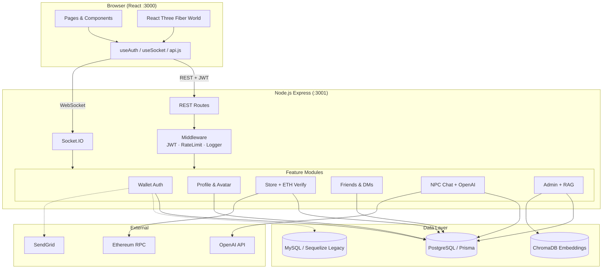

# Architecture

## System Overview



## Frontend Layers

```
src/
├── config/env.js          # API_BASE_URL, SOCKET_URL
├── constants/avatar.js    # Shared avatar defaults
├── hooks/                 # useAuth, useMetaMask, useSocket
├── services/api.js        # Centralized axios client
├── components/
│   ├── world/             # 3D scene, multiplayer, NPC
│   ├── layout/            # AppLayout
│   └── routing/           # WalletRoute, AdminRoute
└── pages/                 # Thin route wrappers
```

## Backend Layers

```
app/
├── config/                # env, auth
├── middleware/            # JWT, rate limit, correlation ID
├── controllers/           # HTTP handlers (thin)
├── services/              # Business logic + Prisma
├── realtime/              # Socket.IO (world + social)
├── prisma/client.js       # DB singleton
└── utils/                 # logger, http helpers
```

## Data Model (Prisma)

Core entities: `User`, `Profile`, `AvatarCustomization`, `StoreItem`, `InventoryItem`, `Friendship`, `DirectMessage`, `NpcConversation`, `KnowledgeBase`, `Role`, `Permission`.

Legacy Sequelize models (`users`, `roles`) coexist for email/password auth during migration.

## Realtime

- **World:** Single room `world-01`, in-memory player state, WebRTC voice with proximity
- **Social:** Per-user rooms `user:{id}`, presence tracking, validated DM/friend events

## Security Model

- Wallet auth: SIWE-style nonce + `personal_sign` → JWT (24h)
- Admin routes: JWT + Prisma/Sequelize role check
- Rate limiting: In-memory sliding window (Redis recommended for production)
- Socket writes require valid JWT

## Known Migration Path

1. Consolidate on PostgreSQL/Prisma single user table
2. Retire Sequelize/MySQL legacy stack
3. Add Redis for rate limits + Socket.IO adapter
4. TypeScript migration (frontend services first)
